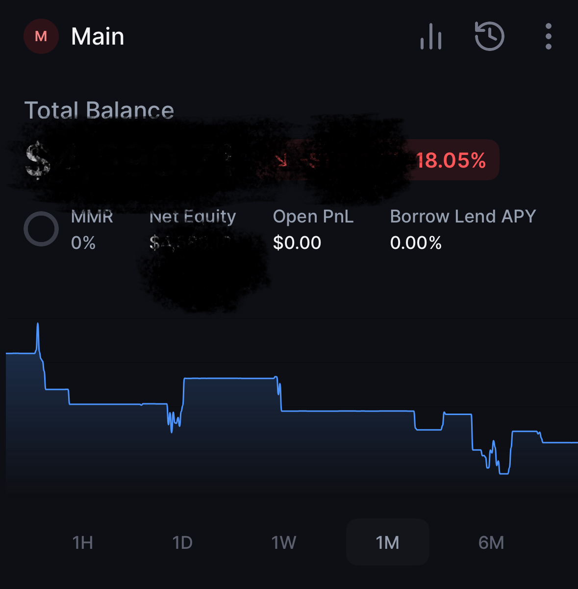
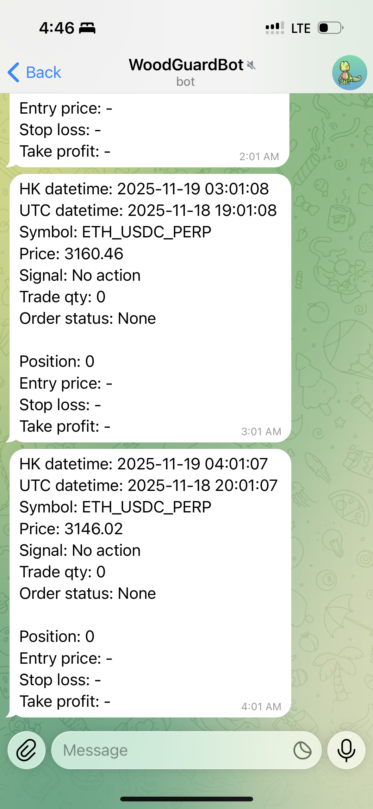

# Backpack Exchange Production Trading Template (2025)

**The most complete open-source Backpack Exchange Python template in 2025**  
Official docs are still broken — this is the only public repo that actually runs end-to-end.

*Real account on Backpack Exchange · 5× leverage only · Steady -18% drawdown · Still alive & fully automated after 1 month*

*systemd service + watchdog + auto-restart · 99.9% uptime since Jan 2025*

### Live Private Bot – Honest Performance (Oct – Nov 2025)
- Single automated strategy, conservative 5× leverage
- Survived prolonged bear market drawdown to **-18%**
- Max realized DD -18% — never blown up, never manually intervened
- Account still running 7×24h on Ubuntu VPS

**In 2025, surviving with low leverage is the real alpha.**

### What this public template includes
- Full ed25519 signature implementation (zero external dependency)
- Balance + position + max-order-quantity queries
- Market / limit orders with automatic `reduceOnly`
- Open orders monitoring & cancellation
- Production-ready structure (systemd + watchdog ready)
- Telegram / Slack alert skeleton (disabled here)

*Live strategy logic and notifications intentionally removed.
*Full bot, honest equity curve, and complete trade log 
*shared only in interviews with serious teams.
